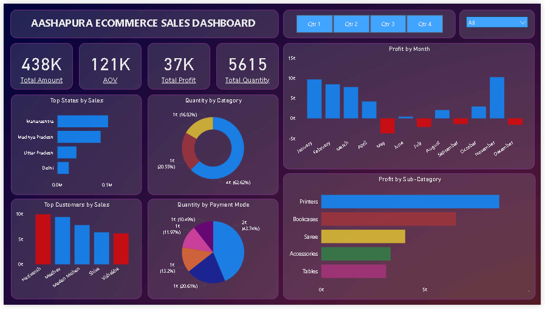

# 🛒 Aashapura E-Commerce Sales Dashboard

An interactive **Power BI Dashboard** built to analyze sales performance, customer behavior, product trends, payment methods, and regional insights for an e-commerce business.

---

## 📸 Dashboard Preview

### Landing Page


### Dashboard


---

## 📌 Project Overview

This dashboard helps businesses monitor key performance indicators (KPIs) and gain actionable insights from e-commerce sales data. It enables users to explore sales trends, customer purchasing patterns, regional performance, and product profitability through interactive visualizations.

---

## 🎯 Objectives

- Analyze overall sales performance
- Track monthly profit trends
- Identify top-performing states and customers
- Monitor product category performance
- Analyze payment mode distribution
- Compare sub-category profitability
- Build an interactive dashboard for business decision-making

---

## 📊 Key KPIs

- 💰 Total Sales Amount
- 💵 Average Order Value (AOV)
- 📈 Total Profit
- 📦 Total Quantity Sold

---

## 📈 Dashboard Features

### Sales Analysis
- Monthly Profit Trend
- Top States by Sales
- Overall Sales KPIs

### Product Analysis
- Quantity by Category
- Profit by Sub-Category

### Customer Analysis
- Top Customers by Sales

### Payment Analysis
- Quantity by Payment Mode

### Interactive Filters
- Quarter Selection
- Category Filter

---

## 🛠️ Tools Used

- Microsoft Power BI
- Power Query
- DAX
- Data Modeling
- Excel / CSV Dataset

---

## 📂 Dataset

The project uses two datasets:

- Orders.csv
- Details.csv

The datasets contain information about:

- Order Details
- Customer Information
- Product Categories
- Sales Amount
- Profit
- Quantity
- Payment Mode
- State

---

## 📊 Dashboard Insights

- Maharashtra generated the highest sales.
- Clothing category contributed the largest quantity sold.
- COD was the most preferred payment mode.
- Printers generated the highest profit among all sub-categories.
- Monthly profit remained consistently positive with January showing the highest performance.
- Top customers contributed significantly to total revenue.

---

## 🚀 Skills Demonstrated

- Data Cleaning
- Data Modeling
- DAX Measures
- Dashboard Design
- Business Intelligence
- Data Visualization
- Interactive Reporting
- KPI Development

---

## 📁 Repository Structure

```
Aashapura-Ecommerce-Sales-Dashboard/
│
├── Dashboard.pbix
├── Orders.csv
├── Details.csv
├── page1.png
├── page2.png
├── README.md
└── LICENSE
```

---

## ⭐ Future Improvements

- Add Year-over-Year (YoY) Sales Analysis
- Forecast Future Sales
- Customer Segmentation
- Profit Margin Analysis
- Dynamic Date Slicer
- Drill-through Reports

---

## 👨‍💻 Author

**Sumeet Dhobale**

📧 Email: sumeetdhobale34@gmail.com

🔗 LinkedIn: *(Add your LinkedIn profile)*

💻 GitHub: https://github.com/YourGitHubUsername

---

If you found this project useful, don't forget to ⭐ star the repository.
